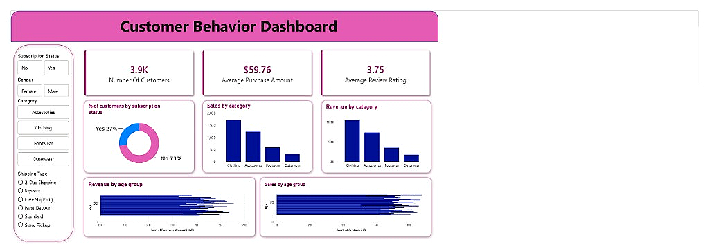

# 🚀 Customer Behavior & Shopping Insights Analysis
> **An End-to-End Data Analytics Project: Python (ETL) ➔ PostgreSQL (SQL Analysis) ➔ Power BI (Interactive Dashboards)**

---

## ✍️ Author
* **Syed Asger Mehdi** — [GitHub Profile](https://github.com/SyedAsgerMehdi)

---

## 🔗 Live Artifacts & Previews
* **Interactive Dashboard**: [Power BI Template File](Customer_Behaviour_dashboard.pbix)
* **Data Processing & Pipeline**: [Jupyter Notebook](Customer_Shopping_Behavior.ipynb)
* **Analytical Queries**: [PostgreSQL Scripts](data%20project.sql)

---

## 📋 Project Overview
This project showcases a complete **Data Analytics Lifecycle** designed to analyze customer demographics, buying patterns, and subscription impact. By implementing a modern data pipeline, I performed **ETL (Extract, Transform, Load)** on raw customer transaction data using Python, stored and queried the processed datasets in PostgreSQL using advanced SQL queries, and designed an interactive executive-facing dashboard in Power BI.

The goal is to turn raw transactional data into **actionable business strategies** to increase customer retention, optimize marketing discounts, and maximize average purchase values.

---

## 🎯 Business Objectives & Problem Statement
For any modern retail business, understanding the customer journey is critical. This project addresses several core business challenges:
1. **Subscription Profitability**: Do subscribed customers spend enough to justify subscription perks?
2. **Product Performance**: Which categories (Clothing, Accessories, Footwear, Outerwear) drive the most revenue?
3. **Discount Optimization**: How do discounts affect total sales and order values?
4. **Target Demographics**: Which age groups and genders contribute the highest lifetime value (LTV)?

---

## 🛠️ Tech Stack & Tools
| Technology | Category | Purpose |
| :--- | :--- | :--- |
| **Python 3.11** | ETL & Preprocessing | Data ingestion, handling missing values, feature engineering |
| **Pandas & NumPy** | Data Wrangling | Handling dataframe structures, binning, mapping categorical variables |
| **PostgreSQL** | Relational Database | Storing clean data and querying complex segments |
| **SQL** | Analytical Querying | Writing subqueries, window functions, and CTEs |
| **Power BI** | Business Intelligence | Interactive dashboard design, data modeling, KPI tracking |

---

## ⚙️ Data Preprocessing & Pipeline (Python)
Using Python and **Pandas**, I developed a robust preprocessing pipeline to transform the raw dataset into a clean, relational-friendly schema. 

### Key Operations Implemented:
1. **Handling Missing Values**: Applied median imputation grouped by product categories to handle any null values in `Review Rating` dynamically.
2. **Schema Standardization**: Converted all column names to lowercase and replaced spaces with underscores for SQL compatibility.
3. **Feature Engineering**:
   - Categorized continuous `age` data into four distinct life stages using quartile binning (`pd.qcut`): `Young Adult`, `Adult`, `Middle-aged`, and `Senior`.
   - Mapped categorical purchase frequencies (e.g., *Weekly*, *Fortnightly*, *Annually*) into numerical columns (`purchase_frequency_days`) to facilitate predictive metrics.
4. **Redundancy Reduction**: Checked collinearity between `discount_applied` and `promo_code_used` (found to be 100% correlated) and dropped the redundant promo code column to optimize database storage.
5. **Database Loading**: Configured a connection engine using `SQLAlchemy` and `psycopg2` to load the dataframe into a PostgreSQL table.

```python
# Feature Engineering: Quartile Binning for Age Groups
labels = ['Young Adult', 'Adult', 'Middle-aged', 'Senior']
df['age_group'] = pd.qcut(df['age'], q=4, labels=labels)

# Frequency Mapping to Numerical Values
frequency_mapping = {
    'Fortnightly': 14, 'Weekly': 7, 'Monthly': 30,
    'Quarterly': 90, 'Bi-Weekly': 14, 'Annually': 365, 'Every 3 Months': 90
}
df['purchase_frequency_days'] = df['frequency_of_purchases'].map(frequency_mapping)
```

---

## 🗄️ Relational Database Management & SQL Analysis
After importing the cleaned data into PostgreSQL, I wrote a suite of analytical SQL queries to extract deep customer intelligence. 

### Advanced SQL Techniques Used:
* **Common Table Expressions (CTEs)** for clean segmentation pipelines.
* **Window Functions (`ROW_NUMBER() OVER PARTITION BY`)** for identifying top performers per category.
* **Conditional Aggregation (`CASE WHEN`)** to calculate product-specific discount conversion rates.

### Featured Queries:
#### 1. Dynamic Customer Segmentation (CTE & CASE WHEN)
*Segments customers based on previous transactions to categorize customer health:*
```sql
WITH customer_type AS (
    SELECT customer_id, previous_purchases,
    CASE 
        WHEN previous_purchases = 1 THEN 'New'
        WHEN previous_purchases BETWEEN 2 AND 10 THEN 'Returning'
        ELSE 'Loyal'
    END AS customer_segment
    FROM customer
)
SELECT customer_segment, COUNT(*) AS "Number of Customers"
FROM customer_type 
GROUP BY customer_segment;
```

#### 2. Top 3 Selling Products Per Category (Window Functions)
*Identifies the most popular items across different clothing categories for inventory optimization:*
```sql
WITH item_counts AS (
    SELECT category, item_purchased, COUNT(customer_id) as total_orders,
    ROW_NUMBER() OVER (PARTITION BY category ORDER BY COUNT(customer_id) DESC) as item_rank
    FROM customer
    GROUP BY category, item_purchased
)
SELECT item_rank, category, item_purchased, total_orders
FROM item_counts
WHERE item_rank <= 3;
```

---

## 📊 Interactive Power BI Dashboard
I connected Power BI to the PostgreSQL server and designed an executive-facing dashboard focusing on **Usability, Layout Harmony, and Dynamic Filtering**.

### Key Visual Elements:
* **Executive KPI Cards**: Real-time display of **Number of Customers (3.9K)**, **Average Spend ($59.76)**, and **Average Rating (3.75)**.
* **Subscription Breakdown**: A donut chart illustrating the ratio of subscribers vs. non-subscribers (27% vs 73%).
* **Sales & Revenue by Category**: Side-by-side comparative bar charts identifying high-performing products.
* **Demographics Profile**: Horizontal distribution charts highlighting sales and customer counts by age and gender.
* **Interactive Slicers**: Multi-dimensional filtering by subscription status, gender, shipping type, and product category.

### 🖼️ Dashboard Preview


---

## 💡 Executive Insights & Strategic Recommendations
Based on the combined Python, SQL, and Power BI analysis, here are the key findings and recommendations:

* **💡 Subscription Opportunity**: Subscribed customers account for **27%** of the total customer base, but have consistent order sizes. **Recommendation**: Implement a loyalty program with exclusive discounts for non-subscribers (the 73% majority) to convert them to recurring subscribers, securing a more predictable revenue stream.
* **💡 Shipping Options**: Average purchase amounts between Standard and Express shipping are identical. **Recommendation**: Incentivize higher purchase sizes by offering free Express shipping for orders above a certain threshold (e.g., $75), maximizing the Average Order Value (AOV).
* **💡 Demographics Optimization**: Adults and Middle-Aged customer segments drive the largest share of overall revenue. **Recommendation**: Tailor targeted marketing campaigns and product recommendations specifically to these segments via social and email channels.

---

## 📁 Project Directory Structure
```
customer_behavior_analysis/
│
├── Customer_Shopping_Behavior.ipynb    # Python ETL & Preprocessing Pipeline
├── data project.sql                    # Production SQL Queries & Analysis
├── Customer_Behaviour_dashboard.pbix   # Power BI Dashboard File
├── customer_shopping_behavior.xlsx     # Cleaned Data Source
│
├── screenshots/
│   └── dashboard.png                   # Cropped High-Res Dashboard Preview
│
└── README.md                           # Recruiter-Facing Documentation
```

---

## 🛠️ Step-by-Step Execution Guide
To reproduce this analysis locally, follow these steps:

1. **Clone the repository**:
   ```bash
   git clone https://github.com/SyedAsgerMehdi/customer_behavior_analysis.git
   cd customer_behavior_analysis
   ```
2. **Execute the Python ETL Notebook**:
   * Open `Customer_Shopping_Behavior.ipynb` in Jupyter Notebook or VS Code.
   * Run all cells to process the dataset and automatically upload it to your local PostgreSQL instance (make sure to update your database credentials in the connection cell).
3. **Execute SQL Analysis**:
   * Connect to your PostgreSQL database.
   * Run the queries in `data project.sql` to generate insights and view tables.
4. **Open the Power BI Dashboard**:
   * Double-click `Customer_Behaviour_dashboard.pbix` in Power BI Desktop.
   * Click **Refresh** to reload the data directly from your PostgreSQL server.

---

## 🎓 Core Competencies & Skills Demonstrated
* **ETL Pipeline Design**: Data cleaning, handling nulls, binning, renaming schemas.
* **Advanced Database Querying**: CTEs, SQL Window Functions, joins, group-by aggregates.
* **Data Visualization & UX**: Designing interactive dashboards, applying color theory, and establishing a visual hierarchy.
* **Business Acumen**: Translating raw data metrics into strategic recommendations for retail stakeholders.
